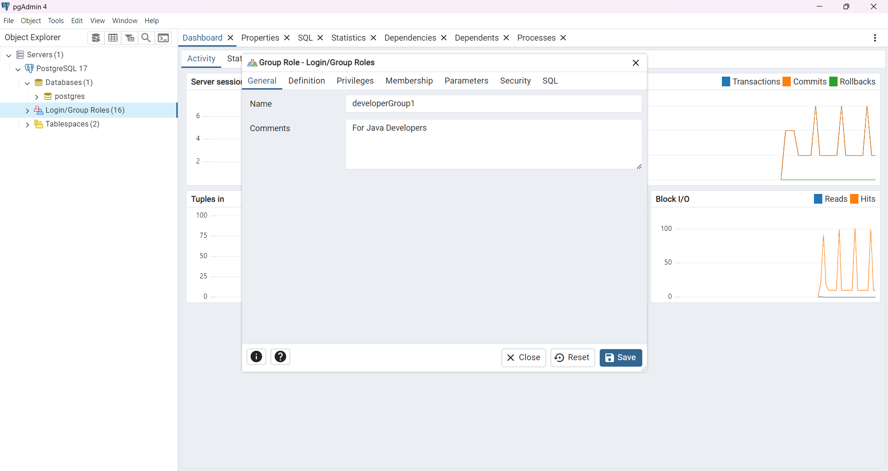
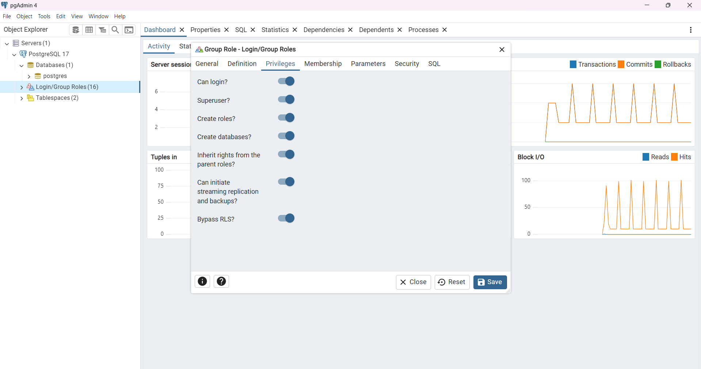
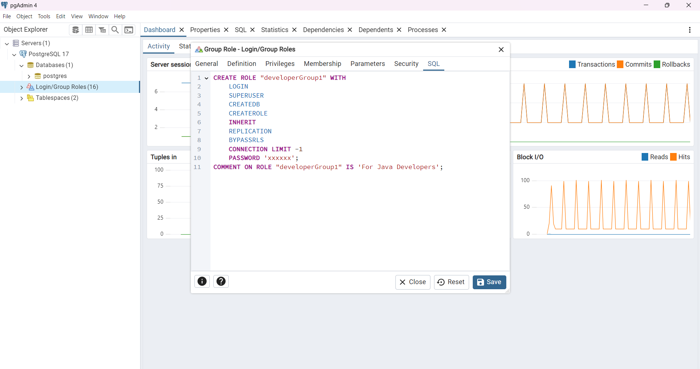
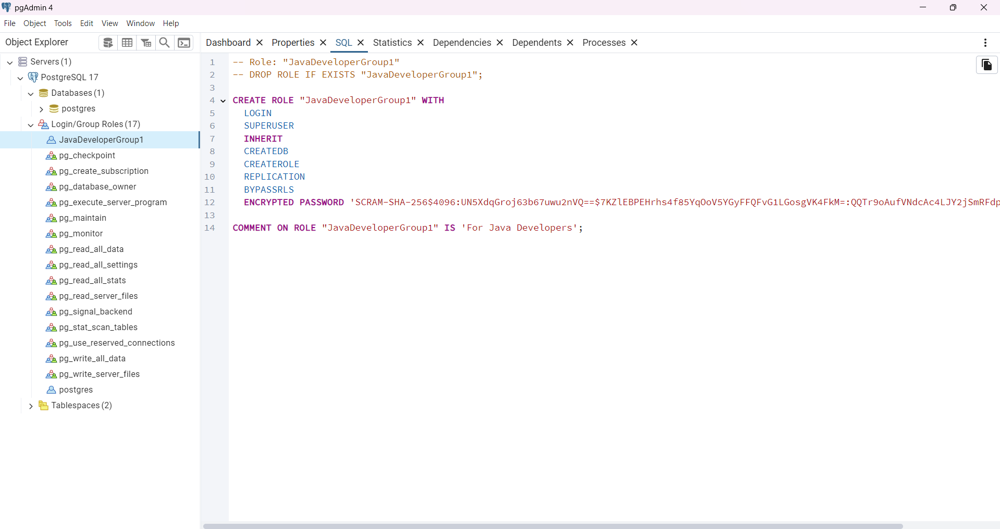

# PostgreSQL-practices

## Connect to PostgreSQL Database using SQL Shell & pgAdmin:

## Using SQL Shell:

## Using pgAdmin:

## User Role Creation

## Comnd To Create Role

        CREATE ROLE "developerGroup1" WITH
            LOGIN
            SUPERUSER
            CREATEDB
            CREATEROLE
            INHERIT
            REPLICATION
            BYPASSRLS
            CONNECTION LIMIT -1
            PASSWORD 'xxxxxx';
        COMMENT ON ROLE "developerGroup1" IS 'For Java Developers';

## After Role Creation:

